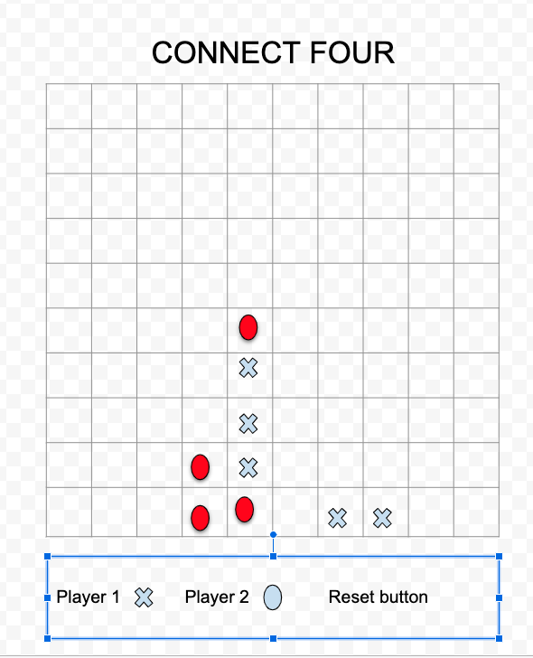

# sei-connectfour-project
CONNECT FOUR PROJECT

## Overview

The objective of the game is to connect four similar dots. It requires 2 players. Each player is assigned a different dot. The first player to connect four dots wins. The UI consists of a table where the players can click to add their dots. The dots will be either a cross or a circle to clearly distinguish the players. After each win, players are able to start new game. 

## Technology used

-HTML
-CSS
-Javascripts
-GitHub project
-Netlify

## Features
-X or O option
-Score board
-Reset game option

## Wireframe

## Project board
https://github.com/gprophete/sei-connectfour-project/projects
